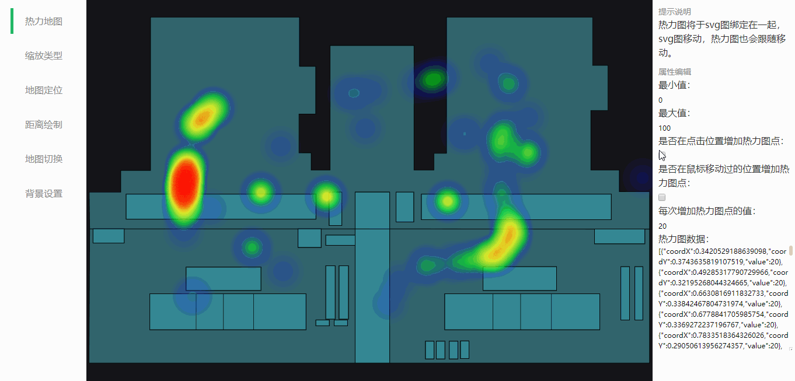
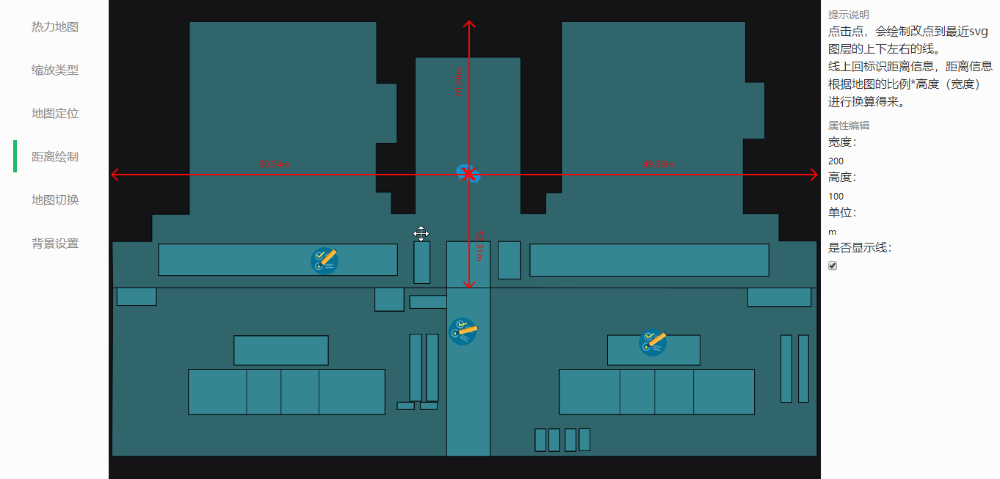
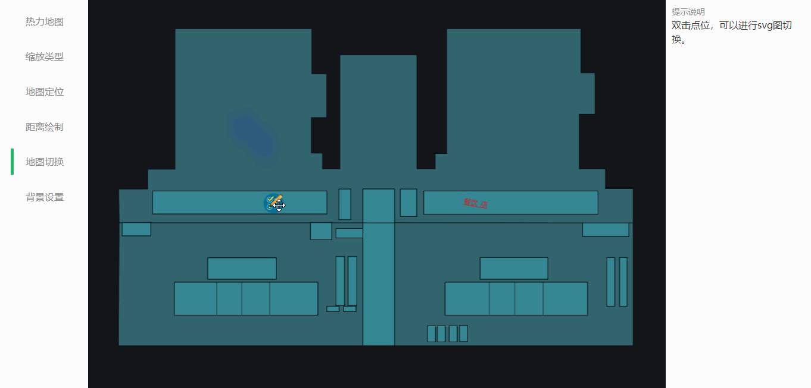
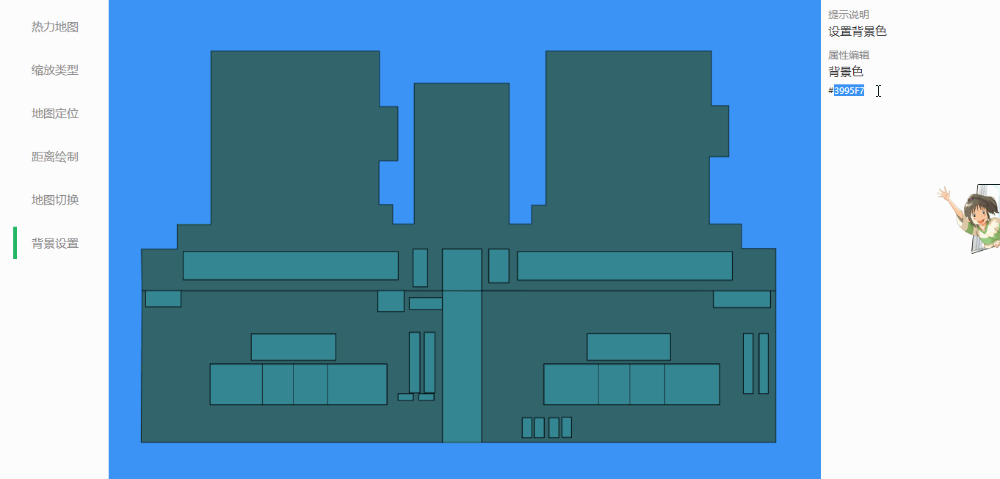

# fabric-map-vue

[](https://www.npmjs.com/package/fabric-map-vue)
[](https://www.npmjs.com/package/fabric-map-vue)
[](https://github.com/nqdy666/fabric-map-vue/blob/dev/LICENSE)

> Fabric-based map location, SVG heatmap

> [CN 中文版](./README.zh_CN.md)

Based on [fabricjs] (http://fabricjs.com/) v2.4.5 development, the heat map is based on [heatmap.js](https://www.patrick-wied.at/static/heatmapjs/) v2.0.5+ development , relying on [Vue.js] (https://vuejs.org/) v2.2.6+.

#### Features
- Auto resize
- heatmap
- Map coordinate
- Distance drawing
- Map switching

## Document
- **[Demo](https://nqdy666.github.io/fabric-map-vue/)**
- **[Example on JSBin](https://jsbin.com/hukeko/edit?html,output)**

## Feature Preview

**Heatmap [sample source] (https://github.com/nqdy666/fabric-map-vue/blob/dev/docs/pages/index.vue)**



**Zoom type [sample source] (https://github.com/nqdy666/fabric-map-vue/blob/dev/docs/pages/zoom.vue)**


**Map Coordinate [sample source] (https://github.com/nqdy666/fabric-map-vue/blob/dev/docs/pages/coord.vue)**


**Distance drawing [sample source code] (https://github.com/nqdy666/fabric-map-vue/blob/dev/docs/pages/distance.vue)**



**Map Switching [sample source] (https://github.com/nqdy666/fabric-map-vue/blob/dev/docs/pages/mapswitch.vue)**



**Background setting [sample source] (https://github.com/nqdy666/fabric-map-vue/blob/dev/docs/pages/background.vue)**



## Installation

#### NPM
Install the package.

```bash
$ npm install fabric-map-vue
```

First need to quote fabric.js

```html
<script script="https://cdn.jsdelivr.net/npm/fabric-map-vue@0.0.9/dist/fabric.min.js"></script>
```

Register the component

```js
Import Vue from 'vue'
Import FabricMapVue from 'fabric-map-vue'
Vue.use(FabricMapVue)
```

You may now use the component in your markup

```html
<fabric-map-vue svg-map-url="https://qiniu.qjzd.net/cf.svg"></fabric-map-vue>
```

#### CDN

include `vue`, `fabric.js`, `heatmap.js`, `fabric-map-vue.js`, `fabric-map-vue.css`

```html
<link rel="stylesheet" href="https://cdn.jsdelivr.net/npm/fabric-map-vue@0.0.9/dist/fabric-map-vue.css"/>
```

```html
<script src="https://cdn.jsdelivr.net/npm/vue@2.6.10"></script>
<script src="https://cdn.jsdelivr.net/npm/fabric-map-vue@0.0.9/dist/fabric.min.js"></script>
<script src="https://cdn.jsdelivr.net/npm/heatmap.js@2.0.5/build/heatmap.min.js"></script>
<!-- Use the latest version -->
<script src="https://cdn.jsdelivr.net/npm/fabric-map-vue@latest"></script>
<!-- or specify a version -->
<script src="https://cdn.jsdelivr.net/npm/fabric-map-vue@0.0.9"></script>
```

You may now use the component in your markup

```html
<fabric-map-vue svg-map-url="https://qiniu.qjzd.net/cf.svg"></fabric-map-vue>
```

## Local development

development
```bash
$ npm i
$ npm run docs-dev
```

publish
```bash
$ npm install -g babel-cli@6.26.0
$ npm install -g rollup@0.67.3
$ chmod a+x scripts/build
$ npm run release
$ git push --follow-tags origin dev && npm publish
```
If you use the window system, you can't execute directly `npm run release`, you need to install git bash software, and then use git bash to execute the command `./scripts/build` and `npm run release:only`.

docs-publish
```bash
$ npm install -g gh-pages
$ chmod a+x scripts/docs-publish
$ npm run docs-publish
```
If you use the window system, you can't execute directly `npm run docs-publish`, you need to install git bash software, and then use git bash to execute the command `./scripts/docs-publish`.

## Donation
If you find it useful, you can buy us a cup of coffee.


## License

[MIT](https://github.com/nianqin/fabric-map-vue/blob/dev/LICENSE.md)

Copyright (c) 2019-present, Qin Nian
